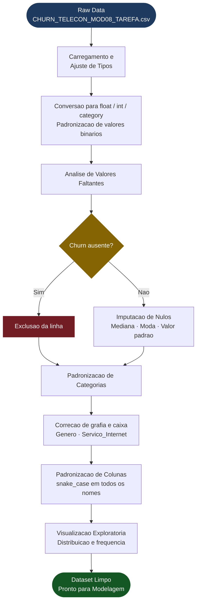

# EBAC - Cientista de Dados | Módulo 14
# Data Preprocessing for Telecom Churn

<p align="center">
  
  
  
  
  
</p>

**Autor / Author:** Gabriel Demetrios Lafis

---

## PT-BR | Portugues

### Sobre o Projeto

Este projeto faz parte da Formação Cientista de Dados da EBAC — Módulo 14 — e aborda o pré-processamento de uma base realista de clientes de uma empresa de telecomunicações. O objetivo é preparar os dados de forma rigorosa e justificada para modelagem preditiva de churn (cancelamento de clientes), cobrindo todas as etapas críticas que precedem qualquer treinamento de modelo.

### O que você vai encontrar neste repositório

- **Notebook completo** com todas as etapas de limpeza, tratamento de valores faltantes, padronização de categorias e visualização exploratória.
- **Explicações detalhadas** e justificativas para cada decisão de pré-processamento, seguindo as melhores práticas de ciência de dados.
- **Gráficos** que mostram a distribuição dos principais atributos e ajudam a embasar as escolhas de imputação.
- **Código limpo e comentado**, pronto para ser usado como referência em projetos reais de análise de churn.

### Pipeline de Pré-Processamento



### Etapas do Projeto

**1. Carregamento e ajuste de tipos**
Conversão de colunas para tipos adequados (`float`, `int`, `category`), padronização de valores binários e categóricos logo na leitura do dataset.

**2. Análise e tratamento de valores faltantes**
- Cálculo do percentual de nulos por coluna.
- Exclusão de linhas sem variável-alvo (`Churn`), pois não contribuem para o treinamento.
- Imputação de valores faltantes com estratégias justificadas: mediana para variáveis contínuas assimétricas, moda para categóricas e valor padrão para campos com semântica clara.

**3. Padronização de categorias**
Correção de inconsistências de grafia e uso de maiúsculas/minúsculas em colunas como `Genero` e `Servico_Internet`, garantindo que o mesmo valor não apareça de formas diferentes.

**4. Padronização dos nomes das colunas**
Aplicação do padrão `snake_case` em todos os nomes de colunas para facilitar a manipulação programática dos dados e evitar erros causados por espaços ou caracteres especiais.

**5. Visualização exploratória**
Gráficos de distribuição e frequência para embasar as decisões de tratamento e documentar o comportamento dos dados antes e depois de cada transformação.

### Como Executar

```bash
# Clone o repositório
git clone https://github.com/galafis/EBAC-PROJETO-CIENTISTA-DE-DADOS-M14.git
cd EBAC-PROJETO-CIENTISTA-DE-DADOS-M14

# Instale as dependencias
pip install pandas matplotlib seaborn jupyter

# Abra o notebook
jupyter notebook M14_PreProcessamento_GabrielLafis.ipynb
```

Ou execute diretamente no **Google Colab** fazendo upload do notebook e do arquivo `CHURN_TELECON_MOD08_TAREFA.csv`.

### Arquivos do Repositório

| Arquivo | Descricao |
|---|---|
| `M14_PreProcessamento_GabrielLafis.ipynb` | Notebook principal com todo o pipeline |
| `CHURN_TELECON_MOD08_TAREFA.csv` | Base de dados de clientes Telecom |
| `README.md` | Documentacao do projeto |

---

## EN | English

### About the Project

This project is part of EBAC's Data Scientist training program — Module 14 — and covers data preprocessing on a realistic telecommunications customer dataset. The goal is to prepare the data rigorously and with clear justification for predictive churn modeling, covering all the critical steps that precede any model training.

### What You Will Find in This Repository

- **Complete notebook** with all steps: data cleaning, missing value treatment, category standardization, and exploratory visualization.
- **Detailed explanations** and rationale for each preprocessing decision, following data science best practices.
- **Charts** showing the distribution of key attributes, supporting the imputation choices made throughout the pipeline.
- **Clean, well-commented code**, ready to be used as a reference in real-world churn analysis projects.

### Preprocessing Pipeline

The diagram in the PT-BR section above illustrates the full preprocessing pipeline:

```
Raw Data → Type Conversion → Missing Values Analysis → Imputation
       → Category Standardization → Column Naming → Clean Dataset
```

### Project Steps

**1. Loading and type adjustment**
Columns are cast to appropriate types (`float`, `int`, `category`), and binary/categorical values are standardized right at read time.

**2. Missing value analysis and treatment**
- Percentage of nulls calculated per column.
- Rows without the target variable (`Churn`) are dropped, as they are unusable for training.
- Remaining nulls are imputed using justified strategies: median for skewed continuous variables, mode for categoricals, and a default value where the field semantics are clear.

**3. Category standardization**
Spelling inconsistencies and mixed casing are corrected in columns such as `Genero` and `Servico_Internet`, ensuring the same value is never represented in multiple different ways.

**4. Column name standardization**
All column names are converted to `snake_case` to simplify programmatic data manipulation and avoid errors from spaces or special characters.

**5. Exploratory visualization**
Distribution and frequency charts are used to justify treatment decisions and document data behavior before and after each transformation.

### How to Run

```bash
# Clone the repository
git clone https://github.com/galafis/EBAC-PROJETO-CIENTISTA-DE-DADOS-M14.git
cd EBAC-PROJETO-CIENTISTA-DE-DADOS-M14

# Install dependencies
pip install pandas matplotlib seaborn jupyter

# Open the notebook
jupyter notebook M14_PreProcessamento_GabrielLafis.ipynb
```

Or run directly in **Google Colab** by uploading the notebook and the `CHURN_TELECON_MOD08_TAREFA.csv` file.

---

**This project demonstrates the rigor required at the preprocessing stage — the foundation for any successful machine learning model.**

---

## Licenca | License

Distribuido sob a licenca MIT. Veja o arquivo `LICENSE` para mais detalhes.

Distributed under the MIT License. See `LICENSE` for more details.

```
MIT License

Copyright (c) 2024 Gabriel Demetrios Lafis

Permission is hereby granted, free of charge, to any person obtaining a copy
of this software and associated documentation files (the "Software"), to deal
in the Software without restriction, including without limitation the rights
to use, copy, modify, merge, publish, distribute, sublicense, and/or sell
copies of the Software, and to permit persons to whom the Software is
furnished to do so, subject to the following conditions:

The above copyright notice and this permission notice shall be included in all
copies or substantial portions of the Software.

THE SOFTWARE IS PROVIDED "AS IS", WITHOUT WARRANTY OF ANY KIND, EXPRESS OR
IMPLIED, INCLUDING BUT NOT LIMITED TO THE WARRANTIES OF MERCHANTABILITY,
FITNESS FOR A PARTICULAR PURPOSE AND NONINFRINGEMENT. IN NO EVENT SHALL THE
AUTHORS OR COPYRIGHT HOLDERS BE LIABLE FOR ANY CLAIM, DAMAGES OR OTHER
LIABILITY, WHETHER IN AN ACTION OF CONTRACT, TORT OR OTHERWISE, ARISING FROM,
OUT OF OR IN CONNECTION WITH THE SOFTWARE OR THE USE OR OTHER DEALINGS IN THE
SOFTWARE.
```

---

*Gabriel Demetrios Lafis*
[github.com/galafis](https://github.com/galafis)
